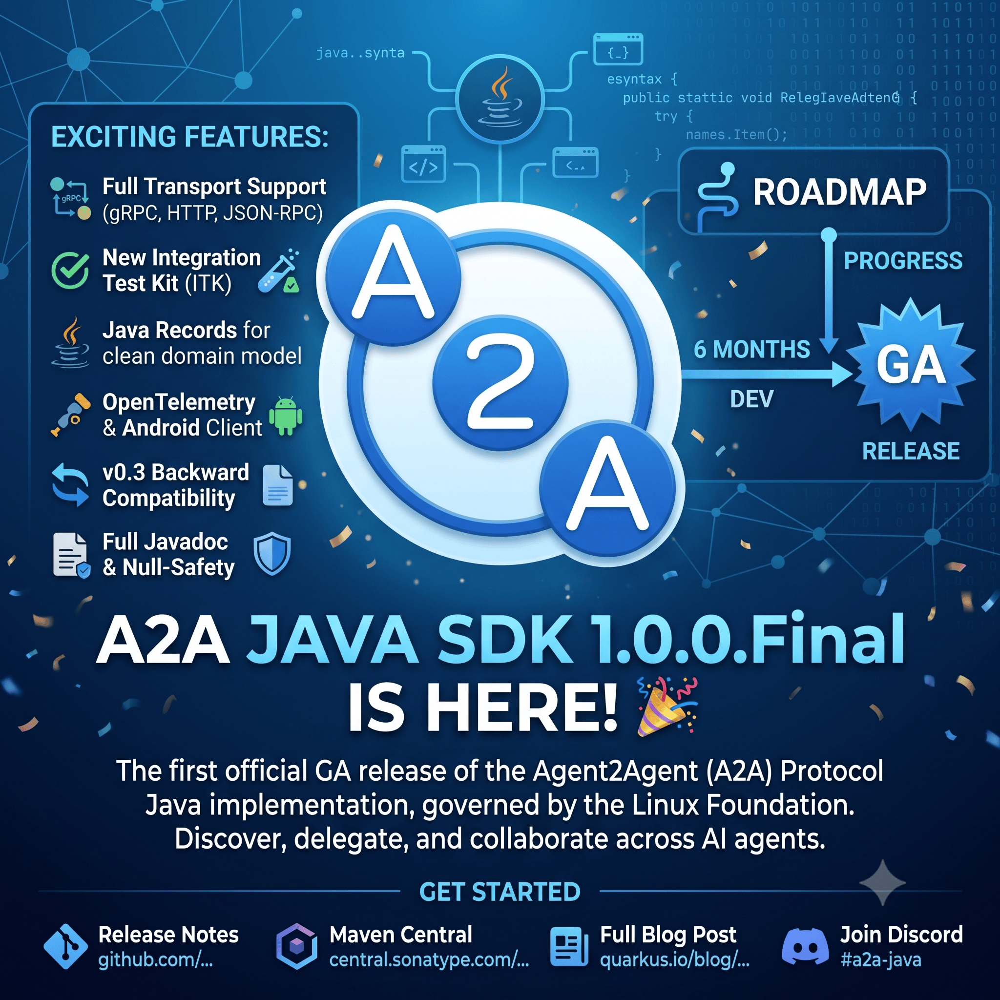

I am pleased to announce the release of [A2A Java SDK 1.0.0.Final](https://github.com/a2aproject/a2a-java/releases/tag/v1.0.0.Final) -- our first GA release. The A2A Java SDK is the official Java implementation of the [Agent2Agent (A2A) Protocol](https://a2a-protocol.org/v1.0.0/specification/), an open standard that enables AI agents to communicate and collaborate regardless of underlying framework, language, or vendor.

This release is the result of six months and seven pre-releases (four Alphas, a Beta, and a Candidate Release), with contributions from 17 people. If you've been tracking the pre-releases, you can upgrade from CR1 with no breaking changes.

## What's A2A?

The Agent2Agent (A2A) Protocol is an open standard, governed by the Linux Foundation, that lets AI agents discover each other's capabilities, delegate tasks, and collaborate -- even if they're written in different languages or built on different frameworks. For example, an orchestrator agent written in Python can delegate to a specialist agent written in Java.

The A2A Java SDK provides everything you need to build A2A server agents and clients in Java, with reference implementations based on [Quarkus](https://quarkus.io) and community integration with [WildFly/Jakarta EE](https://github.com/wildfly-extras/a2a-jakarta).

## Installation

Import the BOM and add the dependencies for your chosen transport:

```xml
<dependencyManagement>
    <dependencies>
        <dependency>
            <groupId>org.a2aproject.sdk</groupId>
            <artifactId>a2a-java-sdk-bom</artifactId>
            <version>1.0.0.Final</version>
            <type>pom</type>
            <scope>import</scope>
        </dependency>
    </dependencies>
</dependencyManagement>

<!-- Pick your transport(s) -->
<dependency>
    <groupId>org.a2aproject.sdk</groupId>
    <artifactId>a2a-java-sdk-reference-jsonrpc</artifactId>
</dependency>
<dependency>
    <groupId>org.a2aproject.sdk</groupId>
    <artifactId>a2a-java-sdk-reference-grpc</artifactId>
</dependency>
<dependency>
    <groupId>org.a2aproject.sdk</groupId>
    <artifactId>a2a-java-sdk-reference-rest</artifactId>
</dependency>
```

All three transports -- JSON-RPC, gRPC, and HTTP+JSON/REST -- are fully supported and considered equal. Just pick the artifact(s) for the transport(s) you need.

## What's New Since 1.0.0.CR1

[1.0.0.CR1](https://github.com/a2aproject/a2a-java/releases/tag/v1.0.0.CR1) was our feature-complete candidate release. Since then, we focused on cross-SDK interoperability validation and bug fixes.

### Integration Test Kit (ITK)

The biggest addition is the Integration Test Kit (ITK) -- a configurable Quarkus-based A2A agent that runs predefined scenarios from the ITK test harness to validate protocol compliance across different SDK implementations (Java, Python, TypeScript, etc.). This gives us confidence that the Java SDK interoperates correctly with agents built using other A2A SDKs.

### Protocol Compliance and Stability Fixes

Driven by ITK testing, we addressed several protocol compliance issues:

* Fixed SSE event listener, gRPC blocking offload handling, and JSON-RPC route consistency across all transports
* Prevented dropped SSE events under back-to-back emission
* Propagated CDI request context correctly to `AgentExecutor` threads and streaming requests
* Improved `A2ACardResolver` to support complete agent card URLs
* Completed the records migration for v0.3 compatibility spec classes

## The Journey from 0.3 to 1.0

The 0.3.x series was our first production-quality SDK, supporting JSON-RPC, gRPC, REST transports, security with OAuth2/Keycloak, and cloud-native deployment with persistent stores and replicated queues. The 1.0 series modernized the SDK to align with the final A2A Specification 1.0.0.

Here is a summary of the major changes. Each of our previous blog posts covers its respective release in detail:

### Specification and API

* **A2A Protocol 1.0 alignment** -- the SDK implements the final [A2A Specification 1.0.0](https://a2a-protocol.org/v1.0.0/specification/), including the new `supportedInterfaces` model for `AgentCard`, removal of `kind` discriminators, and refined error handling ([Alpha1](https://quarkus.io/blog/a2a-java-sdk-1-0-0-alpha1/))
* **Java records throughout** -- all spec domain classes are now Java records, providing immutability, consistent accessor naming (`card.name()` instead of `card.getName()`), and less boilerplate ([Alpha1](https://quarkus.io/blog/a2a-java-sdk-1-0-0-alpha1/))
* **AgentEmitter API** -- replaced the `EventQueue` + `TaskUpdater` combination with a streamlined `AgentEmitter` interface for agent interactions ([Alpha2](https://quarkus.io/blog/a2a-java-sdk-1-0-0-alpha2-released/))
* **Structured error codes** -- A2A error types now carry structured codes and details for precise error handling ([Beta1](https://quarkus.io/blog/a2a-java-sdk-1-0-0-beta1-released/))

### Server Architecture

* **MainEventBus architecture** -- the server internals were rearchitected around a central event bus. Previously, event processing was driven directly by client requests. Now all events flow through a single-threaded `MainEventBusProcessor` that persists events to the `TaskStore` _before_ distributing them to clients. This guarantees clients never see unpersisted events, eliminates race conditions in concurrent task updates, and enables patterns like fire-and-forget tasks and late client reconnections ([Alpha2](https://quarkus.io/blog/a2a-java-sdk-1-0-0-alpha2-released/))

### Infrastructure

* **New coordinates** -- Maven `groupId` changed to `org.a2aproject.sdk` and Java packages renamed to `org.a2aproject.sdk.*`, reflecting the project's home under the [A2A Project organization](https://github.com/a2aproject) ([Beta1](https://quarkus.io/blog/a2a-java-sdk-1-0-0-beta1-released/))
* **Protobuf as source of truth** -- replaced Jackson with Gson and established `a2a.proto` as the authoritative definition, with MapStruct mappers giving compile errors if spec and proto diverge ([Alpha1](https://quarkus.io/blog/a2a-java-sdk-1-0-0-alpha1/))
* **Maven BOMs** -- three BOMs (`a2a-java-sdk-bom`, `a2a-java-extras-bom`, `a2a-java-reference-bom`) for dependency management ([Alpha1](https://quarkus.io/blog/a2a-java-sdk-1-0-0-alpha1/))

### Capabilities

* **OpenTelemetry telemetry** -- built-in tracing and monitoring for both client and server ([1.0.0.Alpha2](https://quarkus.io/blog/a2a-java-sdk-1-0-0-alpha2-released/))
* **Push notifications** -- full server and client support per the A2A 1.0 spec ([1.0.0.Alpha2](https://quarkus.io/blog/a2a-java-sdk-1-0-0-alpha2-released/))
* **v0.3 backward compatibility** -- a compatibility layer that lets v1.0 agents interoperate with v0.3 agents and clients across all three transports, with multi-version convenience modules for serving both protocol versions simultaneously ([1.0.0.CR1](https://quarkus.io/blog/a2a-java-sdk-1-0-0-cr1-released/))
* **Android HTTP client** -- `AndroidA2AHttpClient` using `HttpURLConnection` makes the SDK usable on Android ([1.0.0.CR1](https://quarkus.io/blog/a2a-java-sdk-1-0-0-cr1-released/))
* **Spec-compliant SSE parser** -- a robust `ServerSentEvent` record with full SSE spec compliance ([1.0.0.CR1](https://quarkus.io/blog/a2a-java-sdk-1-0-0-cr1-released/))

### Quality

* **JSpecify null-safety annotations** throughout the spec module
* **Comprehensive Javadoc** on all public API classes
* **TCK conformance** across all three transports for both v1.0 and v0.3 protocols
* **ITK cross-SDK interoperability testing** (Final)

## Contributors

The 1.0.0 series had 17 contributors across all pre-releases. Thank you all for your code, reviews, and feedback!

[@brucearctor](https://github.com/brucearctor), [@CharlieZhang1999](https://github.com/CharlieZhang1999), [@dwieliczko](https://github.com/dwieliczko), [@ehsavoie](https://github.com/ehsavoie), [@HarshaRamesh11](https://github.com/HarshaRamesh11), [@jmesnil](https://github.com/jmesnil), [@kabir](https://github.com/kabir), [@Lirons01](https://github.com/Lirons01), [@LiZongbo](https://github.com/LiZongbo), [@luke-j-smith](https://github.com/luke-j-smith), [@maff](https://github.com/maff), [@neo1027144-creator](https://github.com/neo1027144-creator), [@pratik3558](https://github.com/pratik3558), [@RainYuY](https://github.com/RainYuY), [@sherryfox](https://github.com/sherryfox), [@tsabau](https://github.com/tsabau), [@yyy9942](https://github.com/yyy9942)

## Resources

* [Release Notes on GitHub](https://github.com/a2aproject/a2a-java/releases/tag/v1.0.0.Final)
* [Maven Central](https://central.sonatype.com/artifact/org.a2aproject.sdk/a2a-java-sdk-parent/1.0.0.Final)
* [JavaDoc](https://javadoc.io/doc/org.a2aproject.sdk/)
* [A2A Specification](https://a2a-protocol.org/v1.0.0/specification/)
* [Examples](https://github.com/a2aproject/a2a-java/tree/main/examples)

## Come Join Us

We value your feedback a lot so please report bugs, ask for improvements etc. Let's build something great together!

If you are an A2A Java SDK user or just curious, don't be shy and join our welcoming community:

* provide feedback on [GitHub](https://github.com/a2aproject/a2a-java/issues);
* craft some code and [push a PR](https://github.com/a2aproject/a2a-java/pulls);
* discuss with us in the `#a2a-java` channel on [Discord](https://discord.gg/jTtSkJB74Q);
