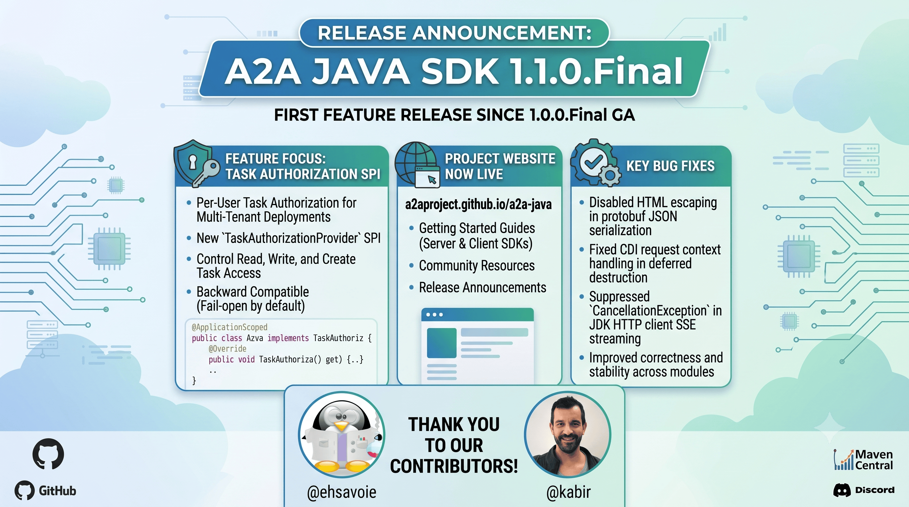

I am pleased to announce the release of [A2A Java SDK 1.1.0.Final](https://github.com/a2aproject/a2a-java/releases/tag/v1.1.0.Final). This is the first feature release after our [1.0.0.Final GA](https://a2aproject.github.io/a2a-java/announces/2026/06/10/a2a-java-sdk-1-0-0-final-released/), bringing per-user task authorization and several stability fixes.

## What's New

### Task Authorization SPI

The headline feature of 1.1.0 is the new `TaskAuthorizationProvider` SPI, which enables **per-user task authorization** for multi-tenant deployments. This is a breaking change for implementations that rely on unguarded task access.

By implementing this SPI as a CDI bean, you can control which users can read, write, or create tasks:

```java
@ApplicationScoped
public class MyTaskAuthorizationProvider implements TaskAuthorizationProvider {

    @Override
    public boolean checkRead(ServerCallContext context, String taskId, TaskOperation op) {
        return isOwner(context.getUser(), taskId);
    }

    @Override
    public boolean checkWrite(ServerCallContext context, String taskId, TaskOperation op) {
        return isOwner(context.getUser(), taskId);
    }

    @Override
    public boolean checkCreate(ServerCallContext context, TaskOperation op) {
        return context.getUser().isAuthenticated();
    }

    @Override
    public boolean isTaskRecorded(String taskId) {
        return ownershipStore.containsKey(taskId);
    }

    @Override
    public void recordOwnership(ServerCallContext context, String taskId, TaskOperation op) {
        ownershipStore.putIfAbsent(taskId, context.getUser().getUsername());
    }
}
```

Key design decisions:

* **Fail-open by default** -- when no `TaskAuthorizationProvider` is present, all operations are permitted, preserving backward compatibility.
* **Information hiding** -- unauthorized access returns `TaskNotFoundError`, making it indistinguishable from a genuinely missing task. Callers cannot probe for the existence of tasks they don't own.
* **Integrated with TaskStore** -- both `InMemoryTaskStore` and `JpaDatabaseTaskStore` support authorization-aware filtering in `listTasks`, so users only see their own tasks.
* **Thread-safe and idempotent** -- the `recordOwnership` contract requires idempotent implementations (e.g., `putIfAbsent`) to handle concurrent task creation safely.

### Project Website

The A2A Java SDK now has its own [project website](https://a2aproject.github.io/a2a-java/), built with [Roq](https://pages.quarkiverse.io/quarkus-roq/) -- a Quarkus-based static site generator. The site includes getting-started guides for the server and client SDKs, community resources, and release announcements.

### Bug Fixes

* **Disabled HTML escaping in protobuf JSON serialization** across REST and JSON-RPC transports -- special characters in agent responses are now preserved correctly ([#947](https://github.com/a2aproject/a2a-java/pull/947))
* **Fixed CDI request context handling** in deferred destruction, preventing errors when the request context was already active ([#950](https://github.com/a2aproject/a2a-java/pull/950))
* **Suppressed `CancellationException`** in JDK HTTP client SSE streaming -- client-side stream cancellations no longer produce noisy stack traces ([#951](https://github.com/a2aproject/a2a-java/pull/951))
* **Added no-args constructors** to response/request classes for Gson compatibility ([#937](https://github.com/a2aproject/a2a-java/pull/937))
* **Improved correctness** and removed dead code across modules ([#954](https://github.com/a2aproject/a2a-java/pull/954))

## Migration from 1.0.0.Final

The `TaskAuthorizationProvider` feature introduces a breaking change to the `TaskStore` interface. If you have **custom `TaskStore` implementations**, you will need to update them to accommodate the new authorization-aware methods.

* If you **don't implement** `TaskAuthorizationProvider`, behavior is unchanged -- all operations are permitted. However, your custom `TaskStore` must still satisfy the updated interface.
* If you **do implement** `TaskAuthorizationProvider`, you'll need to handle ownership recording for pre-existing tasks. We recommend a migration step to backfill ownership data before enabling authorization checks.

Update your BOM version to pick up the new release:

```xml
<dependencyManagement>
    <dependencies>
        <dependency>
            <groupId>org.a2aproject.sdk</groupId>
            <artifactId>a2a-java-sdk-bom</artifactId>
            <version>1.1.0.Final</version>
            <type>pom</type>
            <scope>import</scope>
        </dependency>
    </dependencies>
</dependencyManagement>
```

## Contributors

Thank you to the contributors of this release!

[@ehsavoie](https://github.com/ehsavoie), [@kabir](https://github.com/kabir)

## Resources

* [Release Notes on GitHub](https://github.com/a2aproject/a2a-java/releases/tag/v1.1.0.Final)
* [Maven Central](https://central.sonatype.com/artifact/org.a2aproject.sdk/a2a-java-sdk-parent/1.1.0.Final)
* [JavaDoc](https://javadoc.io/doc/org.a2aproject.sdk/)
* [A2A Specification](https://a2a-protocol.org/v1.0.0/specification/)
* [Project Website](https://a2aproject.github.io/a2a-java/)
* [Examples](https://github.com/a2aproject/a2a-java/tree/main/examples)

## Come Join Us

We value your feedback a lot so please report bugs, ask for improvements etc. Let's build something great together!

If you are an A2A Java SDK user or just curious, don't be shy and join our welcoming community:

* provide feedback on [GitHub](https://github.com/a2aproject/a2a-java/issues);
* craft some code and [push a PR](https://github.com/a2aproject/a2a-java/pulls);
* discuss with us in the `#a2a-java` channel on [Discord](https://discord.gg/jTtSkJB74Q);
