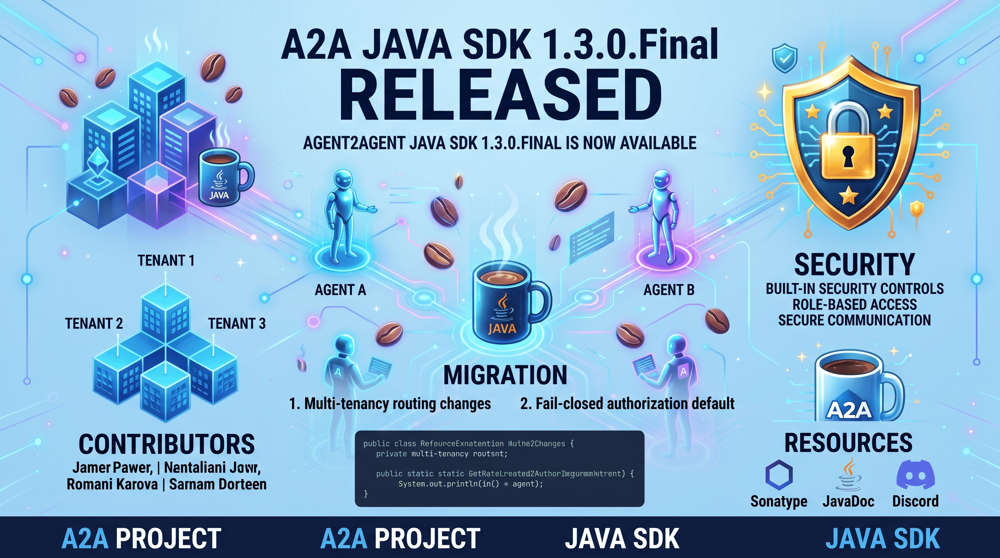

I am happy to announce the release of link:https://github.com/a2aproject/a2a-java/releases/tag/v1.3.0.Final[A2A Java SDK 1.3.0.Final]. This release introduces multi-tenancy support, switches the authorization model to fail-closed by default, delivers a wave of security hardening, and improves protocol compliance across all transports.

NOTE: This release contains **breaking changes**. See the <<migration>> section for details.

== What's New

=== Multi-Tenancy Support

The headline feature of 1.3.0 is **multi-tenancy** (link:https://github.com/a2aproject/a2a-java/pull/1084[\#1084]), which lets a single A2A server provide different agent behavior per tenant. Each tenant can have its own `AgentExecutor` (business logic) and `AgentCard` (capabilities, skills, metadata). Requests without a recognized tenant automatically fall back to the default beans.

Two new SPIs in `server-common` define the routing contract:

* `AgentExecutorRouter` -- resolves an `AgentExecutor` for each request based on the tenant identifier.
* `AgentCardRouter` -- resolves the appropriate `AgentCard` for tenant-specific `getExtendedAgentCard` and public card endpoints.

A CDI-based implementation is provided in the new `a2a-java-extras-multitenancy` module. Use the `@Tenant` qualifier on CDI producer methods to wire tenant-specific beans:

[source,java]
----
@Produces
@Tenant("acme")
public AgentExecutor acmeExecutor() {
    return new AcmeAgentExecutor();
}

@Produces
@Tenant("acme")
@ExtendedAgentCard
public AgentCard acmeCard() {
    return AgentCard.builder().name("Acme Agent")...build();
}
----

The resolved tenant is available in `RequestContext.getTenant()` during execution. Tenant-specific public cards are served at `/.well-known/{tenant}/agent-card.json`. Tenant identifiers are restricted to `a-zA-Z0-9_-.` characters.

When `a2a-java-extras-multitenancy` is not on the classpath, the server behaves as a single-tenant deployment and no code changes are required.

This is a **breaking change** -- see <<multitenancy-migration>> below.

=== Fail-Closed Authorization Default

The authorization model now defaults to **fail-closed** (link:https://github.com/a2aproject/a2a-java/pull/1095[\#1095], link:https://github.com/a2aproject/a2a-java/security/advisories/GHSA-qw47-mcm5-934w[GHSA-qw47-mcm5-934w]). Authorization enforcement has been moved from the CDI-only `AuthorizationRequestHandlerDecorator` directly into `DefaultRequestHandler`, so it is enforced on both the CDI and builder paths. When no `TaskAuthorizationProvider` is configured, all task operations are now denied by default.

To restore the previous open behavior for single-user deployments or testing:

[source,properties]
----
a2a.authorization.required=false
----

This is a **breaking change** -- see <<auth-migration>> below.

=== Security Hardening

This release includes a comprehensive set of security fixes addressing multiple vulnerability classes:

==== Credential leakage prevention

The SDK now validates API key header names against a safe allowlist and disables automatic HTTP redirect following in all HTTP clients (JDK, Vert.x, Android). This prevents credential leakage via header injection and cross-origin redirects (link:https://github.com/a2aproject/a2a-java/pull/1097[\#1097], link:https://github.com/a2aproject/a2a-java/security/advisories/GHSA-9rhm-2h4x-jwmx[GHSA-9rhm-2h4x-jwmx]).

==== SSRF protection for push notifications

Push notification URLs are now validated against an SSRF-safe policy: only allowed schemes, with private-network blocking including IPv4-mapped IPv6. HTTP redirect following is also disabled on push notification POST requests. A new `a2a.push-notifications.enabled` property gates push config storage (link:https://github.com/a2aproject/a2a-java/pull/1096[\#1096], link:https://github.com/a2aproject/a2a-java/security/advisories/GHSA-q78c-5jjq-57g8[GHSA-q78c-5jjq-57g8]).

==== Additional hardening

* **Authorization for listTasks** -- the `onListTasks` handler now performs a list-scoped read check before delegation (link:https://github.com/a2aproject/a2a-java/pull/1038[\#1038])
* **Error message sanitization** -- internal error messages are now sanitized to prevent information disclosure (link:https://github.com/a2aproject/a2a-java/security/advisories/GHSA-x32g-jvvm-4725[GHSA-x32g-jvvm-4725])
* **CR/LF injection prevention** -- push notification headers are validated to reject CR/LF characters (CWE-113) (link:https://github.com/a2aproject/a2a-java/pull/1053[\#1053])

==== Threat model

A threat model has been added to link:https://github.com/a2aproject/a2a-java/blob/main/SECURITY.md[SECURITY.md] (link:https://github.com/a2aproject/a2a-java/pull/1090[\#1090]) to document the SDK's attack surface and security assumptions.

==== Security reporting

We would like to thank the community members who responsibly reported security issues. If you discover a security vulnerability, please follow the process described in our link:https://github.com/a2aproject/a2a-java/blob/main/SECURITY.md[SECURITY.md] -- your reports help us keep the SDK safe for everyone.

=== AgentExecutor as Functional Interface

`AgentExecutor` is now a `@FunctionalInterface` with a default no-op `cancel` method (link:https://github.com/a2aproject/a2a-java/pull/1028[\#1028]). Simple agents that don't need cancellation support can be implemented as lambdas:

[source,java]
----
AgentExecutor executor = (context, emitter) -> {
    emitter.text("Hello!");
    emitter.done();
};
----

Existing implementations with an explicit `cancel` override are unaffected.

=== CDI HTTP Client Provider

The new `a2a-java-extras-http-client-cdi` module (link:https://github.com/a2aproject/a2a-java/pull/1071[\#1071]) adds a `CdiA2AHttpClientProvider` that resolves a user-provided `A2AHttpClient` bean from CDI at priority 200. The `A2AHttpClientFactory` now sorts providers by priority at class init and iterates in order, catching exceptions per-provider for graceful fallback.

=== Protocol Compliance

Several protocol compliance issues have been addressed:

* **Version and extension validation on all operations** -- previously only enforced on message send paths, now checked on all nine JSON-RPC and REST operations per specification section 3.6.2 (link:https://github.com/a2aproject/a2a-java/pull/1066[\#1066]), and on all gRPC handler methods (link:https://github.com/a2aproject/a2a-java/pull/1042[\#1042])
* **Part content key validation** -- the JSON-RPC transport now rejects `Part` objects with multiple populated content keys (link:https://github.com/a2aproject/a2a-java/pull/1065[\#1065]) and prefers a populated content key when decoding (link:https://github.com/a2aproject/a2a-java/pull/1061[\#1061])
* **UnsupportedOperationError** -- streaming endpoints now return `-32004` when the agent card does not advertise streaming support, with a consistent error message across all transports (link:https://github.com/a2aproject/a2a-java/pull/1041[\#1041])
* **FilePart name field** -- `FilePart` now supports an optional `name` field as mentioned in the spec text (link:https://github.com/a2aproject/a2a-java/pull/1091[\#1091])

=== Interoperability Test Kit

The ITK now uses shared scenarios from the upstream A2A specification (link:https://github.com/a2aproject/a2a-java/pull/1094[\#1094]) and has been upgraded to the v2 ITK launcher (link:https://github.com/a2aproject/a2a-java/pull/1063[\#1063]).

== Bug Fixes

* **Enforce task state-machine transitions** -- tasks now follow strict state-machine transition rules, preventing invalid state changes. Cancel operations are serialized to avoid races (link:https://github.com/a2aproject/a2a-java/pull/1045[\#1045])
* **Per-task push notification config limit** -- the `PushNotificationConfigStore` now enforces a per-task limit on push notification configurations (link:https://github.com/a2aproject/a2a-java/pull/1044[\#1044])
* **Hardened event consumer and queue** -- event processing is now more resilient to concurrent access patterns (link:https://github.com/a2aproject/a2a-java/pull/1040[\#1040])
* **Guard limitTaskHistory against negative values** -- `limitTaskHistory` no longer accepts negative `historyLength` values (link:https://github.com/a2aproject/a2a-java/pull/1039[\#1039])
* **Thread-safe InMemoryPushNotificationConfigStore** -- replaced `synchronizedMap` with `ConcurrentHashMap` using atomic per-key operations and immutable snapshot storage (link:https://github.com/a2aproject/a2a-java/pull/1057[\#1057])
* **Deferred AgentCard resolution** -- all transport handlers now resolve `AgentCard` lazily to prevent startup failures when the card producer depends on the HTTP server's bound address (link:https://github.com/a2aproject/a2a-java/pull/1058[\#1058])
* **gRPC transport validation** -- improved validation and error messages in the gRPC transport layer (link:https://github.com/a2aproject/a2a-java/pull/1026[\#1026])

[[migration]]
== Migration from 1.2.0.Final

Update your BOM version:

[source,xml]
----
<dependencyManagement>
    <dependencies>
        <dependency>
            <groupId>org.a2aproject.sdk</groupId>
            <artifactId>a2a-java-sdk-bom</artifactId>
            <version>1.3.0.Final</version>
            <type>pom</type>
            <scope>import</scope>
        </dependency>
    </dependencies>
</dependencyManagement>
----

This release has two breaking changes:

[[multitenancy-migration]]
=== 1. Multi-tenancy routing changes DefaultRequestHandler

The introduction of `AgentExecutorRouter` and `AgentCardRouter` changes the `DefaultRequestHandler` constructor and builder. If you wire `DefaultRequestHandler` programmatically, update to the new API:

[source,java]
----
// Single-tenant: unchanged usage
DefaultRequestHandler handler = DefaultRequestHandler.builder()
    .agentExecutor(agentExecutor)
    .taskStore(taskStore)
    .queueManager(queueManager)
    // ...
    .build();
----

For multi-tenant deployments without CDI, supply an `AgentExecutorRouter` directly on the builder:

[source,java]
----
Map<String, AgentExecutor> executors = Map.of(
    "acme", new AcmeAgentExecutor(),
    "beta", new BetaAgentExecutor()
);
AgentExecutor defaultExecutor = new DefaultAgentExecutor();

AgentExecutorRouter router = tenant ->
    executors.getOrDefault(tenant, defaultExecutor);

DefaultRequestHandler handler = DefaultRequestHandler.builder()
    .agentExecutorRouter(router)         // replaces .agentExecutor() for multi-tenant
    .taskStore(taskStore)
    .queueManager(queueManager)
    // ...
    .build();
----

CDI-based deployments pick up the routers automatically when `a2a-java-extras-multitenancy` is on the classpath.

`GetExtendedAgentCardRequest` now carries `GetExtendedAgentCardParams` to support tenant-specific card resolution.

[[auth-migration]]
=== 2. Fail-closed authorization default

Applications without a `TaskAuthorizationProvider` will now reject all task operations by default. Either:

* Provide a `TaskAuthorizationProvider` implementation, or
* Set `a2a.authorization.required=false` to restore the previous open behavior

[source,properties]
----
# For development/testing or single-user deployments
a2a.authorization.required=false
----

== Contributors

Thank you to the contributors of this release!

link:https://github.com/ehsavoie[@ehsavoie], link:https://github.com/kabir[@kabir], link:https://github.com/ez-lbz[@ez-lbz], link:https://github.com/JakubWorek[@JakubWorek], link:https://github.com/malladinagarjuna2[@malladinagarjuna2], link:https://github.com/omatheusmesmo[@omatheusmesmo], link:https://github.com/ruilopes[@ruilopes], link:https://github.com/KXH[@KXH]

== Resources

* link:https://github.com/a2aproject/a2a-java/releases/tag/v1.3.0.Final[Release Notes on GitHub]
* link:https://central.sonatype.com/artifact/org.a2aproject.sdk/a2a-java-sdk-parent/1.3.0.Final[Maven Central]
* link:https://javadoc.io/doc/org.a2aproject.sdk/[JavaDoc]
* link:https://a2a-protocol.org/v1.0.0/specification/[A2A Specification]
* link:https://a2aproject.github.io/a2a-java/[Project Website]
* link:https://github.com/a2aproject/a2a-java/tree/main/examples[Examples]

== Come Join Us

We value your feedback a lot so please report bugs, ask for improvements etc. Let's build something great together!

If you are an A2A Java SDK user or just curious, don't be shy and join our welcoming community:

* provide feedback on link:https://github.com/a2aproject/a2a-java/issues[GitHub];
* craft some code and link:https://github.com/a2aproject/a2a-java/pulls[push a PR];
* discuss with us in the `#a2a-java` channel on link:https://discord.gg/jTtSkJB74Q[Discord];
