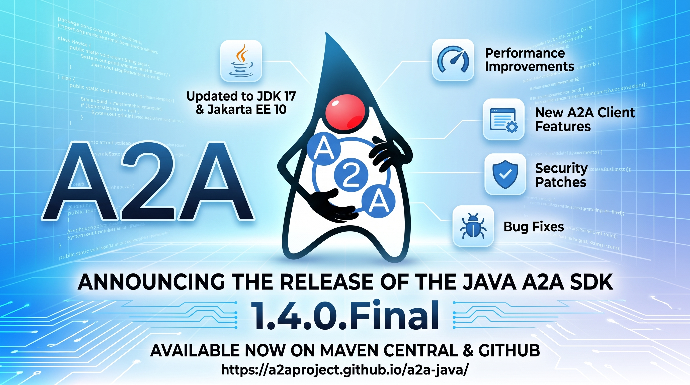

I am happy to announce the release of link:https://github.com/a2aproject/a2a-java/releases/tag/v1.4.0.Final[A2A Java SDK 1.4.0.Final]. This release consolidates the multi-tenancy API with an important breaking change, brings SSE configuration improvements, strengthens interoperability testing, and delivers a large set of bug fixes across all transports.

NOTE: This release contains a **breaking change** affecting the `@Tenant` qualifier. See the <<migration>> section for details.

== What's New

=== Multi-Tenancy: `@Tenant` Qualifier Consolidation

The `@Tenant` qualifier annotation has been moved **from** `a2a-java-extras-multitenancy` **into** `server-common` (link:https://github.com/a2aproject/a2a-java/pull/1176[\#1176]). This is a **breaking change** -- see <<migration>> below.

Moving the qualifier into `server-common` means the CDI runtime can now correctly filter out tenant-qualified beans at all `@PublicAgentCard` and `@ExtendedAgentCard` injection points. Previously, annotating a tenant card with both `@Tenant("x")` and `@PublicAgentCard` would cause CDI ambiguity and result in 404 errors on the default route.

Additional improvements in this area:

* Tenant cards annotated with both `@Tenant("x")` and `@PublicAgentCard` now take precedence over bare `@Tenant` cards at the public card endpoint.
* Duplicate `@ExtendedAgentCard` registrations for the same tenant are now rejected at startup instead of silently winning arbitrarily.
* Missing default `AgentExecutor` beans now throw an explicit exception at startup rather than causing silent runtime failures.
* Agent card resolution now correctly falls back to the router even when no default bean is present (link:https://github.com/a2aproject/a2a-java/pull/1184[\#1184]).

=== SSE Configuration

A new `SSEParserConfig` class (link:https://github.com/a2aproject/a2a-java/pull/1149[\#1149]) makes Server-Sent Events parsing configurable per client. The default per-line size limit has been raised to 1 MB, resolving issues where large message payloads were rejected by the SSE parser.

=== `application/a2a+json` Content-Type Support

The server transports now recognize `application/a2a+json` as a valid content type alongside `application/json` (link:https://github.com/a2aproject/a2a-java/pull/1181[\#1181]), improving out-of-the-box interoperability with clients that send this media type.

=== ITK Enhancements

The ITK test agent gains ACTS SUT behavior support via YAML configuration (link:https://github.com/a2aproject/a2a-java/pull/1150[\#1150]), along with CI workflow integration and an auth precondition implementation (link:https://github.com/a2aproject/a2a-java/pull/1157[\#1157]). These additions make it easier to configure and run interoperability tests against the upstream ACTS test harness.

=== Documentation Improvements

* A complete `TaskAuthorizationProvider` implementation example has been added to the documentation (link:https://github.com/a2aproject/a2a-java/pull/1146[\#1146]).
* Security advisory link:https://github.com/a2aproject/a2a-java/security/advisories/GHSA-4fpj-g9jf-9rgg[GHSA-4fpj-g9jf-9rgg] has been incorporated into the threat model (link:https://github.com/a2aproject/a2a-java/pull/1148[\#1148]).
* JDK HttpClient's restricted `Host` header behavior and the Vert.x HTTP client as an alternative are now documented (link:https://github.com/a2aproject/a2a-java/pull/1180[\#1180]).

== Bug Fixes

* **Task history** -- current status messages are no longer incorrectly included in task history (link:https://github.com/a2aproject/a2a-java/pull/1122[\#1122])
* **Push notification config** -- omitted push config IDs are now accepted in both HTTP (link:https://github.com/a2aproject/a2a-java/pull/1092[\#1092]) and gRPC (link:https://github.com/a2aproject/a2a-java/pull/1163[\#1163]) transports
* **Push notification ordering** -- delivery order of push notifications per task is now preserved (link:https://github.com/a2aproject/a2a-java/pull/1156[\#1156])
* **gRPC `Part.metadata`** -- the `metadata` field is now correctly mapped in 0.3 gRPC classes (link:https://github.com/a2aproject/a2a-java/pull/1169[\#1169])
* **Blank task/context IDs** -- blank `taskId` and `contextId` values in `messages/send` are treated as absent (link:https://github.com/a2aproject/a2a-java/pull/1172[\#1172])
* **JSON null preservation** -- explicit JSON nulls in value mappings are now preserved correctly (link:https://github.com/a2aproject/a2a-java/pull/1174[\#1174])
* **Relative redirects** -- relative `Location` header values in HTTP redirects are now resolved against the request URI (link:https://github.com/a2aproject/a2a-java/pull/1162[\#1162])
* **SSE terminal callback** -- exactly one terminal SSE callback is now guaranteed (link:https://github.com/a2aproject/a2a-java/pull/1173[\#1173])
* **`A2ACardResolver` fallback URL** -- a fallback URL is now always provided (link:https://github.com/a2aproject/a2a-java/pull/1179[\#1179])
* **Event bus processor** -- the event bus processor now starts correctly when using manual (non-CDI) wiring (link:https://github.com/a2aproject/a2a-java/pull/997[\#997])
* **Terminal enqueue recovery** -- failed terminal enqueue operations are now recovered (link:https://github.com/a2aproject/a2a-java/pull/1185[\#1185])

[[migration]]
== Migration from 1.3.x

Update your BOM version:

[source,xml]
----
<dependencyManagement>
    <dependencies>
        <dependency>
            <groupId>org.a2aproject.sdk</groupId>
            <artifactId>a2a-java-sdk-bom</artifactId>
            <version>1.4.0.Final</version>
            <type>pom</type>
            <scope>import</scope>
        </dependency>
    </dependencies>
</dependencyManagement>
----

[[tenant-migration]]
=== `@Tenant` Import Change (Breaking)

The `@Tenant` qualifier has moved from the `a2a-java-extras-multitenancy` module into `server-common`, and its package has changed accordingly. Any class that imports `@Tenant` must be updated:

[source,java]
----
// Before (1.3.x) -- from the extras module
import org.a2aproject.sdk.extras.multitenancy.Tenant;

// After (1.4.0) -- from server-common
import org.a2aproject.sdk.server.multitenancy.Tenant;
----

The annotation's semantics are unchanged. No other code modifications are required.

=== Missing Default `AgentExecutor` Now Throws

If a CDI-based multi-tenant deployment has no default `AgentExecutor` bean, the server will now throw an explicit exception at startup. Previously this would compile and deploy successfully but fail silently at runtime. Ensure a default `AgentExecutor` bean is always registered, or supply an `AgentExecutorRouter` programmatically via the builder:

[source,java]
----
AgentExecutorRouter router = tenant ->
    executors.getOrDefault(tenant, defaultExecutor);

DefaultRequestHandler handler = DefaultRequestHandler.builder()
    .agentExecutorRouter(router)
    .taskStore(taskStore)
    .queueManager(queueManager)
    // ...
    .build();
----

== Contributors

A big thank you to all contributors of this release -- and a warm welcome to those joining for the first time!

link:https://github.com/ehsavoie[@ehsavoie], link:https://github.com/kabir[@kabir], link:https://github.com/JakubWorek[@JakubWorek], link:https://github.com/014-code[@014-code], link:https://github.com/1fanwang[@1fanwang], link:https://github.com/hutiefang76[@hutiefang76], link:https://github.com/serhiy-bzhezytskyy[@serhiy-bzhezytskyy], link:https://github.com/56wj[@56wj], link:https://github.com/paulrutter[@paulrutter], link:https://github.com/girishkvs[@girishkvs], link:https://github.com/chopmob-cloud[@chopmob-cloud]

== Resources

* link:https://github.com/a2aproject/a2a-java/releases/tag/v1.4.0.Final[Release Notes on GitHub]
* link:https://central.sonatype.com/artifact/org.a2aproject.sdk/a2a-java-sdk-parent/1.4.0.Final[Maven Central]
* link:https://javadoc.io/doc/org.a2aproject.sdk/[JavaDoc]
* link:https://a2a-protocol.org/v1.0.0/specification/[A2A Specification]
* link:https://a2aproject.github.io/a2a-java/[Project Website]
* link:https://github.com/a2aproject/a2a-java/tree/main/examples[Examples]

== Come Join Us

We value your feedback a lot so please report bugs, ask for improvements etc. Let's build something great together!

If you are an A2A Java SDK user or just curious, don't be shy and join our welcoming community:

* provide feedback on link:https://github.com/a2aproject/a2a-java/issues[GitHub];
* craft some code and link:https://github.com/a2aproject/a2a-java/pulls[push a PR];
* discuss with us in the `#a2a-java` channel on link:https://discord.gg/jTtSkJB74Q[Discord];
